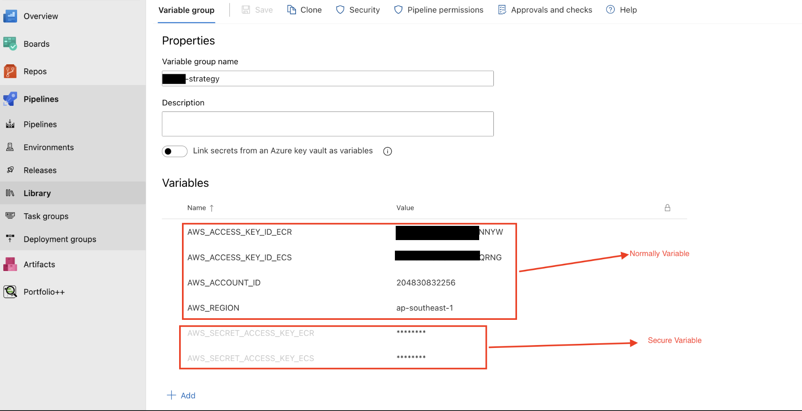
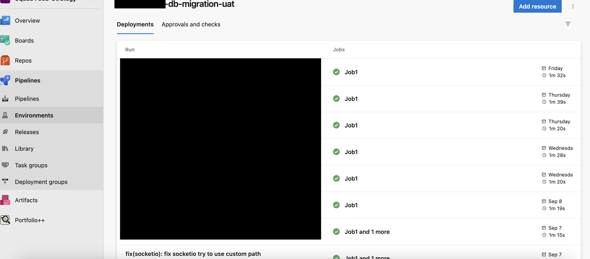
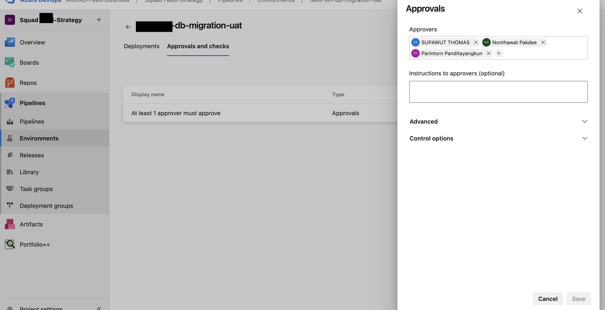

## Required Knowledge

- Basic Linux Command
- Build Tool for each Programming Language (dotnet,Node,Python,Go,JAVA)
- YAML ([Learning in 10 minute click](https://youtu.be/BEki_rsWu4E?si=5stTunZb7bmZb_fS))
- Optional
  - Basic Python (Accees file and io)
  - Docker

---

#AzurePipeline
*I focus on YAML Pipeline*

There are 2 type
- Classic pipeline (GUI)
  - Build (as CI. currently it is disappear from azure devop menu)
  - Release (as CD )
- YAML Pipeline (if can be both CI/CD in one file or seperate file. it depends on your workflow)


---

# Pipeline Component

  
- Stage
- Job and Agent (MS Host and SelfHost)
  - Job type
    - Deployment (auto download pipeline Artifact)
    - Job
- Step
  - task
  - script
---

# Trigger and Resource

Type  of Trigger

- CI Trigger
- PR Trigger
- Schedule Trigger
- Pipeline Completion Trigger (Trigger from another pipeline)

## CI Trigger 
is trigger from version control 


<center>VersionCotrol that can be used with AzureDevops </center>
<br>
<br>


<center>Exmaple Code</center>
you can specific  include or exclude Branch or tags and paths of your workspace. if condition is matched then pipeline will run.
<br>
<br>

## PR Trigger

is trigger from version control like CI trigger but it focus on event pull request instead push.


<center>Exmaple Code PI trigger</center>


## Schedule Trigger

you can config by both GUI and YAML. [More detail](https://learn.microsoft.com/en-us/azure/devops/pipelines/process/scheduled-triggers?view=azure-devops&tabs=yaml)


<center>Exmaple Code Schedule trigger. you can set more than one schedule in same pipeline</center>
<br>
<br>
<br>


<center>Cron synctax</center>
<br>
<br>
<br>


<center>Exmaple cron result</center>
<br>
<br>

## Pipeline Completion Trigger

this trigger type for triggering from one pipeline to other pipeline. 
it is very useful when you want to seperate cd pipeline file from ci.


<center>Exmaple Trigger from another pipeline, </center>
<br>

- Tigger:none is mean disable any trigger from version control
- pipeline: ci is alias name that can be used to referance in this pipeline file.
- source: funny-sln-system-ci is name of origin pipeline that can run success.

<br>
<br>

## Resources that can trigger pipeline 
including
- pipeline
- repository ( github,azure repo)
- container ( dockerhub,acr)
- package (npm,nuget from AzureArtifact)
- webhook (by httpClient calling like fetch or axios)
[more detail](https://learn.microsoft.com/en-us/azure/devops/pipelines/process/resources?view=azure-devops&tabs=schema)

---

# Varibales

## Catagory (informally)

- **Pipeline Variable Environent**
is any variable that define in root,global,stage,job scope like below.
```
jobs:
- job: build
  variables:
  - foo: bar 
  steps:
    - bash: |
        echo $(foo)            # This will be bar
        echo '##vso[task.setvariable variable=foo]baz'
        echo $(foo)            # This will also be bar, $(foo) expands before the step
        echo $[foo]            # This will be baz, $[foo] expands during the step

    - bash: echo $(foo)        # This will be baz. The variable is expanded just before the step
```
<br>

- **Task or Script Variable Environment**
is variable that define  within script or task like below
```steps:
  # Sets FOO to be "some value" in the script and the next ones
  - bash: |
      # this is task variable
      FOO1="runtime value"

      #this is a way to declare pipeline variable enviroment in script
      echo "##vso[task.setvariable variable=FOO]$FOO1" 

  # Using the $() syntax during "compile time", the pipeline expands the variable
  - bash: |
      # to reference pipeline environment variable that use logging command synctax to set.
      echo "$(FOO)"

      # this task environment variable
      echo "$FOO1"
    env:
      FOO1:$(FOO)

  # Using an environment variable in the script context at "runtime", bash expands the variable
  - bash: |
      # this is task environment variable (task env will be applied from pipeline variable in parent level automatically )
      echo "$FOO"
```

## Data Type

- String
- Number
- Boolean
- Object
- Array

## Scope
precedence variable scope (sort by ascending)
- Root (in UI Console)
- Global (In Yaml)
- Stage
- Job
- Step
  - A step includig
    - Step Type => Task or Script
    - displayname
    - condition
    - env

example 
```
variables:
  foo: 'global variable'

stages:
- stage: build
  variables:
   - name: foo
     value: 'defined at stage level'

  jobs:
  - job: compile
    variables:
    - name: foo
      value: 'defined at job level'
    steps:
      - bash: echo $(foo) # This will be 'defined at job level'
```

## Get and Set Variables in each scope

- Template String (Eval At Compile Time)
  - synctax ${{variable}}
- Macro (Eval Runtime but value will be changed for next task )
  - synctax $(variable)
- Runtime (Eval at runtime and value is changed immidieatly)
  - synctax $[variable]
- Setting Pipeline Variable (in task level)
  - Loggin Command (Set during execute task in step) 
  ```"##vso[task.setVariable variable=HAS\_TEST\_RESULT]true"\```

To additional

- must use _ (underscore) instead of dot in Task at step level for referencing attribute of Pipeline variable (object type) 
> such as [foo.bar] in script it can be referenced by native environment
> - in bash use FOO_BAR
> - in Poweshell as $env:FOO_BAR 


## Sharing Variable In  Different scope

- share in same pipeline
  - between 
    - step
    - job
    - stage
- share across pipeline
    - variable group
    - by pipeline artifact
    - by repository (git)

### Share in same pipeline

Using output variable to decalre variable and use it in different scope
> an output variable is defined and value generated by the output of a task.
> Output variables are dynamic and represent the result of a particular task.
> You will never know an output variable’s value until a task in the pipeline runs.

<br>
#### Creating output variables
There are two different ways to create output variables – by building support for the variable in the task itself or setting the value ad-hoc in a script.

- Existing and custom tasks (mostly task will declare outvar)
for example below there BuildNumber as Task
  ```
  # Download artifacts from a specific branch with a tag

  - task: DownloadPipelineArtifact@2
    inputs:
      buildType: 'specific'
      project: 'FabrikamFiber'
      definition: 12
      buildVersionToDownload: 'latestFromBranch'
      branchName: 'refs/heads/master'
      tags: 'testTag'
    name: 'TEST'

    # referencing output variable from previous step
  - bash: echo $(TEST.BuildNumber)
  ```
- Ad-hoc output variables via script
  
  syntax
  ```
      - bash: |
        echo "##vso[task.setvariable variable=imageTag;isoutput=true]$(resources.pipeline.ci.runName)"
        displayName: Generate imageTag variable from ci pipeline run number
        name: generateImageTag

      # referencing output variable from previous step (same job)
      - bash: echo $(generateImageTag.imageTag)
  ```

#### reference output variable from step level (sameJob)

```
stages:
  - stage: Stage1
    displayName: Stage1
    jobs:
      - job: Job1
        steps:
          - bash: |
          echo "##vso[task.setvariable variable=imageTag;isoutput=true]$(resources.pipeline.ci.runName)"
          displayName: Generate imageTag variable from ci pipeline run number
          name: generateImageTag

          # referencing output variable from previous step (same job)
          - bash: echo $(generateImageTag.imageTag)
```
<br>

#### reference output variable from job level (same stage)

```
stages:
  - stage: Stage1
    displayName: DisplayStage1
    jobs:
      - job: Job1
        steps:
          - bash: |
          echo "##vso[task.setvariable variable=imageTag;isoutput=true]$(resources.pipeline.ci.runName)"
          displayName: Generate imageTag variable from ci pipeline run number
          name: generateImageTag

          # referencing output variable from previous step (same job)
          - bash: echo $(generateImageTag.imageTag)

      - job: Job2
        steps:
          - bash: |
          echo $(dependencies.Job1.outputs['generateImageTag.imageTag'])
          displayName: show outputvariable
          name: displayOutput
```
<br>

#### reference output variable from stage level (same pipeline)

```
stages:
  - stage: Stage1
    displayName: DisplayStage1
    jobs:
      - job: Job1
        steps:
          - bash: |
          echo "##vso[task.setvariable variable=imageTag;isoutput=true]$(resources.pipeline.ci.runName)"
          displayName: Generate imageTag variable from ci pipeline run number
          name: generateImageTag

          # referencing output variable from previous step (same job)
          - bash: echo $(generateImageTag.imageTag)
  - stage: Stage2
    displayName: DisplayStage2
    jobs:
      - job: Job1
        steps:
          - bash: |
          echo $(stageDependencies.Stage1.Job1.outputs['generateImageTag.imageTag'])
          displayName: show outputvariable
          name: displayOutput
```
<br>

### Share across pipeline 

by pipeline artifact

- Once the file with the variable value exists, you’d then use the Publish Build Artifacts Task to send all files in the variables folder to the pipeline assigning it the name variables.
```
#in pipeline1.yml file
stages:
- stage: firststage
jobs:
- job: firstjob
steps:
- bash: |
FOO="some value"
mkdir -p $(Pipeline.Workspace)/variables
echo "$FOO" > $(Pipeline.Workspace)/variables/FOO
- publish: $(Pipeline.Workspace)/variables
artifact: variables
```
<br>

- In the second pipleline, you’d then download the build artifacts, read the variable from the saved file and assign it to another variable. You can see a great example of this below.

```
# in pipeline2.yml file
- stage: secondstage
jobs:
- job: secondjo
steps:
- download: current
artifact: variables
- bash: |
FOO=$(cat $(Pipeline.Workspace)/variables/FOO)
echo "##vso[task.setvariable variable=FOO]$FOO"
- bash: |
echo "$(FOO)"
```


---

## Variable Type

- Predefine [(more detail)](https://learn.microsoft.com/en-us/azure/devops/pipelines/build/variables?view=azure-devops&tabs=yaml)
  - Agent
  - Build
  - Pipeline
  - Deployment job
  - System
- UserDefine
- Output Variables (Can be used in same stage)

---

## Variable Group

> Variable groups, as you might expect, are “groups” of variables that can be referenced as one. The primary purpose of a variable group is to store values that you want to make available across multiple pipelines.
>
> Unlike variables, variable groups are not defined in the YAML file. Instead, they are defined in the **Library** page under **Pipelines** in the UI.

<br>
<br>


<center>Example to define variableGroup both normally and secure variable</center>

<br>
<br>
<br>


<center>Example to import variableGroup and reference variable from group</center>

<br>
<br>
<br>

---

## Parameters


<center>Example to define parameter</center>

<br>
<br>
<br>


<center>Example to reference parameter in pipeline</center>

<br>
<br>
<br>


<center>Example to use parameter when run pipeline manually</center>

<br>
<br>

---

## Template
is a group of steps that you can reuse it at any job.

<br>


<center>Example to predefine steps for reusing at any job</center>

<br>
<br>


<center>Example applying template at job's step</center>
‌

---

## Artifact
There are 3 type
- Build Artifact
- Pipeline Artifact (recommended) [more detail](https://learn.microsoft.com/en-us/azure/devops/pipelines/artifacts/pipeline-artifacts?view=azure-devops&tabs=yaml-task)
- Azure Artifact
<br>

####Build Artifact
**Pros**
  - It can be used both classic and yaml pipeline
  - no extra charged for storing the file

**cons**
  - problem with large file size
  - it can store only acrhive file like .tar,.zip
<br>
<br>

####Pipeline Artifact (recommended)
**Pros**
 - it's faster than Build Artifact and it can 
 - it can store any file type such as .tar,.zip,.json and etc.
 - no extra charged for storing the file

**Cons**
- It can be used both only in yaml pipeline
<br>
<br>

####Azure Artifact
it's  a package registry likes npm,nuget,maven,pip 

**Pros**
 - To be able to share file across project or Azure Account 

**Cons**
- There are extra charge when usaged capacity size over 2 GiB
---

## Azure Environment And Approval Gate

###Azure Environment
 is a collection of resources that you can target with deployments from a pipeline. Typical examples of environment names are Dev, Test, QA, Staging, and Production.

So you can track deployment job history on Azure Environment 
<br>


<center>Example binding Azure Environent to Deployment job</center>
<br>


<center>Example deployment job history that releated to Azure Environment</center>

<br>

### Approval Gate
It allows you to define person who can approval for executing deployment job that is releated to Azure environment.

‌
<center>Example define approval gate of Azure Environment and assign people to approval </center>

‌
<center>Example deployment job that is applied approval gate </center>

---
#Expression and Function

[More detail](https://learn.microsoft.com/en-us/azure/devops/pipelines/process/expressions?view=azure-devops#variables)

---
#Service Connections
---